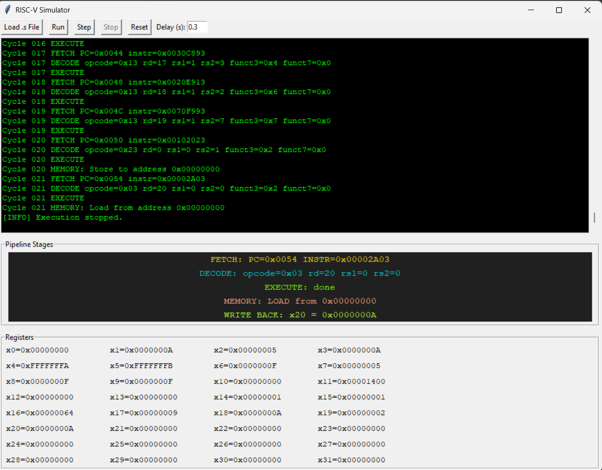

# 🖥️ [RISC-V Educational Simulator with GUI](https://github.com/anjrzdgn/RISC-V-Design)

A complete Python-based RISC-V simulator designed for learning, debugging, and visualizing how RISC-V instructions work step-by-step. This project includes:

- ✅ Full support for **RV32I** and **RV32M** instructions  
- ✅ A powerful **assembler** that converts `.s` files to binary  
- ✅ A **step-by-step simulator** that shows all 5 pipeline phases  
- ✅ A clean and user-friendly **Tkinter-based GUI**  
- ✅ Support for pseudo-instructions like `mv`, `nop`, `li`, `neg`, ...

---

## 📸 GUI Preview

> The GUI provides step/run simulation, PC tracking, live register updates, and phase visualization.

<p align="center">
  
</p>

---

## 📁 Project Structure

```bash
📦 RISC-V-Simulator/
├── assembler.py         # Assembler to convert RISC-V assembly to machine code
├── simulator.py         # Instruction-by-instruction simulator with pipeline logic
├── instruction_set.py   # Dictionary of all supported RISC-V opcodes & formats
├── registers.py         # Register mapping (x0-x31, named + numbered)
├── main.py              # Command-line interface for batch running
├── gui.py               # GUI with Tkinter (Run / Step / Stop / Reset + Reg View)
├── program.s            # Sample test program
├── program.bin          # Binary output of the assembler
└── README.md            # This file
```
This project is Done for our Computer Architecture course in 2025 spring - IUT
1. Seyed Soroush Daneshvar
2. Ali Najjarzadegan
3. Mohammad Mahdi Narimani